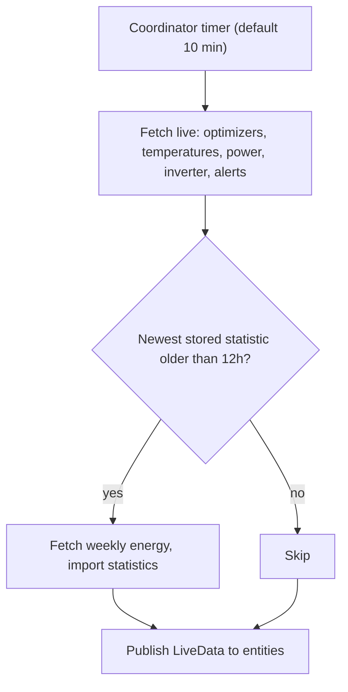

# SolarEdge web client integration design

Date: 2026-09-04

Domain: `solaredge_ha_web_client`

## Purpose

A Home Assistant custom integration (HACS, own repository) that surfaces
**per-optimizer detail** from the SolarEdge web portal's private API — data that
neither the local Modbus integration nor HA core's `solaredge` exposes as
entities.

It replaces HA core's `solaredge` integration entirely.

## Context

The site this is designed against:

| Fact | Value |
|------|-------|
| Inverter | SE11.25K-IL0T0BEN4, three-phase, firmware 0004.0024.0022 |
| Peak power | 11.7 kWp |
| Panels | JinkoSolar JKM 600N-72HL4-BDV, 600 W N-type bifacial |
| Optimizers | SolarEdge P1100, some carrying two modules |
| Consumption meter | none |
| Battery | none |
| Array | non-uniform, multiple roof orientations |

The target platform:

| Fact | Value |
|------|-------|
| Home Assistant | core-2026.9.0, Container install |
| Python | 3.14.6 |
| HACS | 2.0.5 |
| Recorder | SQLite 3.53.2 |
| HA timezone | Asia/Jerusalem (matches the site timezone) |

HA and site timezones agreeing is convenient but must not be **relied on**.
Statistics conversion reads `siteTimeZone` from the API regardless, because a
site abroad or a change to either setting would otherwise shift every imported
hour.

Site ID, credentials and serial numbers are **placeholders** throughout this
document, per the repo rule against committing identifying values. Real values
live only in the Home Assistant config entry.

## Scope boundary

Three data sources with deliberately non-overlapping responsibilities:

| Source | Owns | Cadence |
|--------|------|---------|
| `solaredge_modbus_multi` (local) | Site and inverter live electrical truth | 5 s |
| `solaredge_ha_web_client` (this) | Per-optimizer detail, site extras, module statistics | 10 min |
| HA core `solaredge` | *removed* | — |

Core's integration had two independent halves. The API-key half (site energy
sensors) is already superseded by Modbus — local, faster, and immune to the
V1 API retirement on 2026-11-01. Only the username/password half (module-level
statistics) needs absorbing here.

## Repository

The integration code lives in a **separate repository**, not here.

This repo declares itself a "selective kit, not a bootable HA config" and holds
no `custom_components/`. A HACS integration is a Python package with a manifest,
tests and CI, which does not fit that shape. This config repo therefore holds
only this spec, the eventual implementation plan, and any dashboard YAML that
consumes the new entities.

## Non-goals

- **Weather.** Available from the library, but Home Assistant has better sources.
- **Site-level energy entities.** The Energy Dashboard is fed by Modbus; a second
  site energy series would invite double-counting.
- **Array geometry (tilt / azimuth).** Not exposed by `solaredge-web`. See
  *Future scope*.
- **Any write or control operation.** Read-only.

## Architecture

A thin wrapper around the [`solaredge-web`](https://github.com/Solarlibs/solaredge-web)
PyPI package, pinned in `manifest.json`. All HTTP, login, cookie and CSRF
handling stays upstream — this integration contains **no networking code of its
own**. That is what keeps SolarEdge's endpoint churn (which broke consumers in
July 2026) from becoming a local maintenance burden.

### One coordinator, not two

A single `DataUpdateCoordinator` polls live data. On each refresh it checks
whether statistics are due, and if so imports them within the same sequential
pass.



Rationale: a single sequential fetcher makes overlapping requests **structurally
impossible**, so no `asyncio.Lock` is required. Two independent timers could
interleave requests on one shared login session, which is the failure mode most
likely to get a session invalidated on an undocumented API.

**Statistics are gated on elapsed time, not a cycle counter.** `get_last_statistics`
already records when we last wrote, so no state needs persisting. This is
self-healing across restarts and remains correct at any poll interval.

### Session

Exactly **one** `SolarEdgeWeb` client per config entry, so there is only ever one
login session, constructed as:

```python
SolarEdgeWeb(username, password, site_id, session, timeout=10)
```

`session` is Home Assistant's shared `aiohttp` session via
`async_get_clientsession(hass)` — the integration creates no session of its own.

Authentication is **OAuth2 PKCE** (the portal modernised away from bare
cookie-and-CSRF), handled entirely inside the library. `async_login()` runs at
the head of every public method and reuses its session for an hour, so nothing
here needs to track token lifetime.

Roughly 300 ms spacing between requests within a cycle — cheap politeness on an
API with no published rate limits and no support channel.

### Intervals

| Concern | Value |
|---------|-------|
| Live poll | 10 min default, 5 min floor, configurable via options |
| Statistics import | every 12 h |

The 5-minute floor is deliberate: optimizers only report every ~15 minutes, so
faster polling gains nothing and only adds load.

### Module layout

```
custom_components/solaredge_ha_web_client/
  __init__.py          entry setup/unload, coordinator wiring
  config_flow.py       credentials + site_id, reauth, options
  coordinator.py       single coordinator, statistics gating
  models.py            typed snapshot and live dataclasses
  entity.py            shared base: device_info, availability
  sensor.py            per-optimizer and site sensors
  binary_sensor.py     alerts, per-inverter connectivity
  statistics.py        energy data to long-term statistics
  diagnostics.py       redacted dump
```

Only `coordinator.py` touches the library.

## Data model

Frozen dataclasses in `models.py`:

```python
@dataclass(frozen=True)
class OptimizerInfo:
    serial: str            # placeholder, e.g. "AAAAAAAA-AA"
    display_name: str      # "1.1.7"
    inverter_serial: str
    string_name: str       # "1.1"

@dataclass(frozen=True)
class InverterInfo:
    serial: str
    display_name: str

@dataclass(frozen=True)
class SiteSnapshot:
    site_id: str
    peak_power_kwp: float          # async_get_site_information
    timezone: str                  # siteTimeZone
    has_meter: bool                # hasConsumptionAndGrid
    has_storage: bool
    inverters: tuple[InverterInfo, ...]
    optimizers: tuple[OptimizerInfo, ...]
```

`timezone` is load-bearing, not decoration: the library returns **naive
site-local** datetimes, so statistics import cannot be correct without it.

`SiteSnapshot` is fetched once per config entry at setup, from
`async_get_equipment`, `async_get_site_information` and
`async_get_site_components`. None of it changes between hardware changes.

`LiveData` carries per-section success flags so partial results are
representable (see *Error handling*).

## Device tree

```
SolarEdge Site <placeholder>        (site device)
└── Inverter <placeholder>          (via_device = site)
    ├── Optimizer 1.1.1             (via_device = inverter)
    ├── Optimizer 1.1.2
    └── ...
```

Strings are **not** devices. Home Assistant has no good concept for them and the
extra device rows are clutter; the string name is an attribute on each optimizer.

## Entities

### Per optimizer

| Entity | Source field | Device class | State class | Default |
|--------|--------------|--------------|-------------|---------|
| Power | `OptimizerData.power` (W) | `power` | `measurement` | enabled |
| Max temperature today | `async_get_optimizer_temperatures` (C) | `temperature` | `measurement` | enabled |
| Module voltage | `OptimizerData.voltage` (V) | `voltage` | `measurement` | disabled, diagnostic |
| Optimizer voltage | `OptimizerData.optimizer_voltage` (V) | `voltage` | `measurement` | disabled, diagnostic |
| Current | `OptimizerData.current` (A) | `current` | `measurement` | disabled, diagnostic |
| Last measurement | `OptimizerData.last_measurement` | `timestamp` | — | disabled, diagnostic |

With roughly 20 optimizers this is ~40 useful entities rather than 100 of noise.
Temperature is enabled because it is how a hot-spotting panel is spotted.

**Temperature is a daily maximum, not a live reading.**
`async_get_optimizer_temperatures(start_date, end_date)` returns *each
optimizer's highest temperature over a date range*, so called with today's date
it yields today's peak. The entity name must say so — a plain "Temperature"
would be read as current panel temperature, and someone would eventually chart
it against irradiance and be confused for an afternoon. It resets at local
midnight, which is why the site timezone matters here too.

The library reports whichever unit the site is configured for and converts to
Celsius itself, so no unit handling is needed locally.

Note that `OptimizerData` exposes **two** voltages — `voltage` is the module
side and `optimizer_voltage` the optimizer's output — and both are worth having
as diagnostics, since a divergence between them is the signature of an
optimizer fault.

### Per inverter

| Entity | Type | Default |
|--------|------|---------|
| Connectivity | `binary_sensor` / `connectivity` | enabled, diagnostic |
| AC Power (Cloud) | `sensor` / `power` | enabled |

### Site

| Entity | Type | Default |
|--------|------|---------|
| Alerts | `binary_sensor` / `problem` | enabled |
| Site Power (Cloud) | `sensor` / `power` | enabled |
| Peak power (kWp) | `sensor`, **no device class, no state class** | enabled, diagnostic |
| Last successful update | `sensor` / `timestamp` | enabled, diagnostic |

Notes:

- **The "(Cloud)" qualifier is mandatory** on anything that duplicates a Modbus
  entity. Without it, two sensors meaning nearly the same thing but disagreeing
  by minutes and watts sit adjacent in every entity picker.
- **Peak power carries no device class.** `kWp` is a nameplate rating; Home
  Assistant has no device class that accepts it, and `device_class: power` with
  `kWp` fails unit validation.
- **"Last successful update" exists so staleness is observable.** Availability
  holds last-known values through failures (below), which without this entity
  would present up to 30 minutes of stale numbers with nothing admitting it.
- **No entity anywhere carries `device_class: energy`.** Cloud energy lives only
  in statistics. An enabled `total_increasing` kWh sensor would become eligible
  for the Energy Dashboard's solar source picker beside the Modbus sensor, and
  selecting both would silently double production forever. Power cannot be
  mistakenly added as an energy source; energy can. Enforced by a guard test.

## Statistics

Long-term statistics only — no entities.

### Identifiers

Keyed on **panel position**, not serial:

```
solaredge_ha_web_client:<site>_opt_1_1_7
solaredge_ha_web_client:<site>_str_1_1
solaredge_ha_web_client:<site>_inv_<placeholder>
```

Rationale: if an optimizer fails and is replaced, its serial changes and that
panel's history would split in two — precisely when continuous history matters
most. Position-keyed IDs survive hardware swaps, with the serial as an attribute.
The tradeoff is that re-editing the portal layout misattributes history, which is
far rarer than a component swap.

**This diverges from HA core deliberately.** Core keys on `slugify(serial)` and
carries a migration map that matches old numeric IDs to serials by statistic
name. Its own code documents the cost of that choice: replacement modules share
a name with the units they replaced, so core detects the collision and *skips*
the migration for those panels, logging "the match is ambiguous." Keying on
position sidesteps the problem rather than detecting it.

The library corroborates this. `async_get_equipment()` filters out
`properties.status == "INACTIVE"` by default, its docstring explaining that
retired equipment "keeps the same display name as its live replacement." Display
names being stable across a swap is exactly the property these statistic IDs
depend on.

**A translation step is therefore required.** `EnergyData.values` is keyed by
**serial**, so importing under position keys means mapping serial to display name
through the `SiteSnapshot`. Two consequences to get right:

- Equipment must be fetched with the **default** `include_inactive=False`.
  Including inactive units would produce two entries with the same display name,
  and the panel's history would take whichever the iteration order happened to
  hit last.
- A serial appearing in `values` with no match in the snapshot must be logged
  and skipped, not silently dropped. That is what a mid-run hardware change
  looks like, and it should be visible in the log.

Site-level energy is intentionally excluded.

### Metadata

The `StatisticMetaData` API changed recently — `has_mean` gave way to
`mean_type`, and `unit_class` became required — so the current shape is:

```python
StatisticMetaData(
    mean_type=StatisticMeanType.NONE,
    has_sum=True,
    name=f"{entry.title} {display_name}",
    source=DOMAIN,
    statistic_id=statistic_id,
    unit_class=EnergyConverter.UNIT_CLASS,
    unit_of_measurement=UnitOfEnergy.WATT_HOUR,
)
```

`mean_type=StatisticMeanType.NONE` is a **deliberate deviation from core**,
which passes `StatisticMeanType.ARITHMETIC`. An hourly energy total has no
meaningful mean, and we never populate `StatisticData.mean`, so declaring
`ARITHMETIC` advertises an aggregation that will never be supplied. `NONE` is
the faithful translation of the old `has_mean=False`.

### Source endpoint

`async_get_energy_data()` — **one** request returning hourly figures for every
optimizer, string and inverter.

Values are **derived**: the library reads `compressPowerData` in watts from the
playback API and multiplies by the one-hour slot to get Wh. Optimizer figures
come from the API; string, inverter and site figures are summed from child
optimizers.

The alternative, `async_get_optimizer_energy()`, returns *measured* figures that
match `async_get_energy_totals()` to the decimal. It is chosen against on cost:
its signature takes a list of serials but returns `list[SiteEnergyData]`, whose
per-slot payload is a **single aggregate** `energy` value for everything passed
in. Per-panel numbers therefore require one request per panel — about 20 per
import, against one. The derived interpolation error applies roughly uniformly
across panels, so it largely cancels for panel-to-panel comparison, which is the
actual use case. Its magnitude is unquantified; see *Open risks*.

### Import window

Pass `start_date` and `end_date` **explicitly** rather than relying on the
defaults. The window runs from the last stored statistic minus a small overlap,
up to now; overlapping hours are safe because re-importing the same hour
overwrites rather than accumulates.

Cap the span. Playback endpoints reject or truncate over-wide ranges — the
library carries per-resolution maxima and logs a warning instead of failing — so
a first run on a site with a long history must walk the range in chunks rather
than asking for everything at once. `async_get_data_availability()` supplies
`productionDataAvailableFrom` as the lower bound.

### Cumulative sums

`async_add_external_statistics` expects **cumulative** sums, not hourly deltas.
Each run must read the last stored sum via `get_last_statistics` and accumulate
onto it. Getting this wrong produces Energy Dashboard resets or step changes.

**Port HA core's `solaredge` coordinator logic rather than reimplementing it.**
It solves exactly this problem, using the same library against the same
endpoints, in the open. This is the highest-risk code in the integration and the
reason not to write it fresh.

Specifically, reuse core's approach to establishing the baseline: query
`statistics_during_period` for the hour immediately before the import window and
take its `sum`; if nothing is there, fall back to `get_last_statistics` and
accept that value **only if its start precedes the window**; otherwise start
from `0.0`. That fallback is what makes an integration that has been offline
longer than the available history resume without a discontinuity.

Port with **two deliberate deviations**:

1. **Timezone.** Core does
   `start_time.replace(tzinfo=dt_util.get_default_time_zone())`, attaching *Home
   Assistant's* timezone to a timestamp the library documents as site-local.
   Those agree on this installation and silently disagree for a site abroad.
   Use the IANA name from `siteTimeZone` instead.
2. **No dummy listener.** Core registers a no-op listener to force refreshes,
   because a statistics-only coordinator drives no entities and would otherwise
   never poll. Our coordinator has live entities subscribed, so the hack is
   unnecessary — a small dividend of folding statistics into the live
   coordinator.

## Config flow and auth

Single step: **username, password, site ID**. No API key field — that was core's
other half and it is gone.

Validation calls `async_get_site_information()`, which proves the credentials and
confirms site visibility in one call. Site ID becomes the entry `unique_id`, so
re-adding the same site aborts.

- **Reauth** asks for the password only, preserving username and site ID.
- **Options** exposes the live poll interval (5–60 min).

### Reauth policy

Only a **definitive credential rejection** raises `ConfigEntryAuthFailed`.

Web sessions expire as normal operation and the library re-authenticates
silently. Mapping every auth-flavoured failure to reauth would nag the user to
re-enter a password for something that already healed itself. Ambiguous failures
are ordinary retries. The cost — genuinely wrong credentials take an extra cycle
to surface — is clearly the better trade.

## Error handling

Specific exceptions, specific responses. **No blanket handler swallows anything**,
and every handler logs the endpoint it was calling.

The library makes this mapping straightforward, and deliberately so: on a failed
login it raises `aiohttp.ClientResponseError` with **status 401** rather than a
plain `ClientError`, its own docstring noting this is "so that callers can tell
bad credentials apart from a transient failure." Exception type therefore
carries the distinction, and no string-matching on error messages is needed.

| Condition | Exception seen | Response |
|-----------|----------------|----------|
| Bad credentials | `ClientResponseError`, status 401 / 403 | `ConfigEntryAuthFailed` (triggers reauth) |
| Rate limited | `ClientResponseError`, status 429 | `UpdateFailed` plus temporary interval increase |
| Bad arguments / range too wide | `ClientResponseError`, status 400 | Log warning naming endpoint, skip that fetch, continue cycle |
| Server-side failure | `ClientResponseError`, status 5xx | `UpdateFailed`, coordinator backs off |
| Connection error, timeout | `aiohttp.ClientError` (non-response), `TimeoutError` | `UpdateFailed`, coordinator backs off |
| Bad resolution passed | `ValueError` | **Do not catch.** Programmer error — let it surface |

`ValueError` is explicitly not handled. The library raises it for invalid
arguments such as an unsupported resolution string, which means our own code is
wrong; catching it would convert a bug we should fix into a silent retry loop.

Session expiry needs no handling at all. `async_login()` is called at the head
of every public method and reuses its OAuth2 PKCE session for one hour, so
re-authentication is internal and invisible. With a 10-minute poll this means
roughly one real login per hour.

### Partial success is the normal case

A live cycle hits several endpoints; one failing must not discard the others.
Endpoints are gathered with `return_exceptions=True` and assembled into a
`LiveData` carrying per-section flags. If temperatures fail but optimizer data
succeeds, power, voltage and current publish and temperature goes unknown.

### Statistics error boundary

The statistics import sits in its **own** error boundary. It logs specifically and
returns without failing the cycle. Live data is the cycle's product; statistics
are a side effect. A twice-daily history import must never take 20 live panel
sensors down with it.

### Availability

Entities hold last-known values and flip to unavailable only after **three
consecutive fully failed cycles**. Immediate unavailability would strobe every
panel across the dashboard on a single SolarEdge hiccup, and is misleading
precision given the data is inherently ~15 minutes stale. Staleness is instead
made visible through the "Last successful update" entity.

## Migration

Ordered. The first step is a prerequisite, not a preference.

1. **Repoint the Energy Dashboard solar source at the Modbus energy sensor**
   (`sensor.solaredge_modbus_i1_ac_energy`) and confirm statistics are recording.
   Removing core first would silently stop solar recording.
   *Status: done and verified 2026-09-04.*
2. Remove HA core's `solaredge` config entry.
3. Install this integration and configure it.

Core's existing per-module statistics remain in the recorder as orphaned but
still-queryable series. Per-panel history restarts from the changeover; this was
accepted deliberately rather than squatting on core's statistic ID namespace.

## Test plan

Failing tests are written **before** implementation. Priority reflects where the
bugs actually live.

### Statistics (highest risk)

- Cumulative sums accumulate correctly onto an existing stored sum.
- Re-importing overlapping hours does not double-count.
- Naive site-local timestamps convert via `siteTimeZone` into correctly aligned
  hour buckets.
- Statistic IDs derive from panel position and are properly slugified.
- Import is skipped when the newest stored statistic is under 12 h old, and runs
  when it is older.

### Config flow

- Success, `invalid_auth`, `cannot_connect`, duplicate-site abort, reauth path.
- A definitive credential rejection triggers reauth; a transient session expiry
  does **not**.

### Coordinator resilience

- Partial endpoint failure yields partial data with correct section flags.
- A statistics failure does not fail the cycle or affect live entities.
- Availability stays true at one and two consecutive failures, flips at three.

### Structural guards

- Device tree nests optimizers under inverters under the site.
- **No entity carries `device_class: energy`.** This mechanically enforces the
  double-count decision rather than relying on anyone remembering it.
- Peak power sensor has no device class and no state class.

### Diagnostics

- Credentials and serials absent from the redacted dump.

### Tooling

Anonymised recorded payloads as fixtures, under
`pytest-homeassistant-custom-component`. CI runs `ruff`, `mypy --strict`,
`pytest`, plus hassfest and HACS validation.

## Open risks

- **Concurrent session behaviour is unverified.** Whether two simultaneous
  private-API sessions coexist or invalidate each other is unknown. The
  single-client, single-coordinator design avoids creating the situation
  internally, and removing core eliminates the other session entirely — but the
  underlying behaviour remains untested.
- **Derived vs measured energy discrepancy is unquantified.** Believed small and
  uniform across panels. If it ever matters, `async_get_energy_totals()` would
  measure it for one extra request per cycle.
- **The private API is undocumented.** It moved endpoints in July 2026 and its
  login path has a published CSRF/OOB vulnerability, so SolarEdge may harden it.
  Mitigated but not eliminated by delegating all networking to `solaredge-web`.

## Future scope

- **Layout / geometry.** The portal's Physical view overlays panels on aerial
  imagery, so positions are geo-referenced and azimuth is derivable in principle.
  `solaredge-web` wraps no layout endpoint, so this would require new
  reverse-engineering. Tilt is not obtainable from an overhead view regardless.
  Deferred — the forecast needs these values once, which is not a reason to build
  a continuously syncing integration.
- **Upstreaming to HA core.** The library is already a core dependency, so these
  entities are a natural core addition. Core currently creates no module entities
  *by design* (data is delayed), so this is worth revisiting only once a custom
  integration has demonstrated the value.
